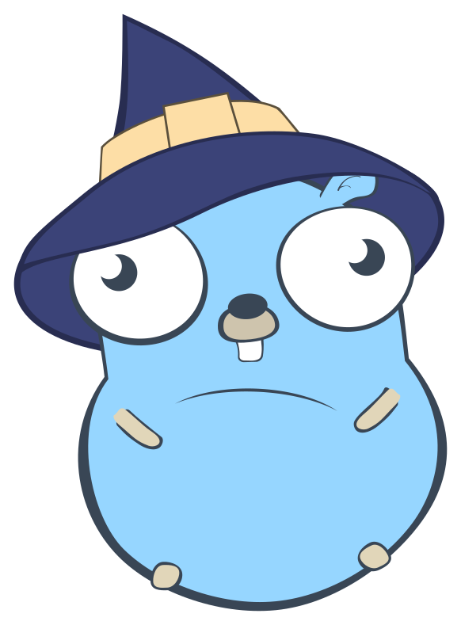

[](https://codecov.io/gh/sebastianmarines/golisp)
[](https://github.com/sebastianmarines/golisp/actions/workflows/main.yml)
[](https://github.com/sebastianmarines/golisp/actions/workflows/release.yml)

---

<br />
<div align="center">
  <a href="https://github.com/othneildrew/Best-README-Template">
    
  </a>

  <h1 align="center">GoLisp</h1>

  <p align="center">
    A Lisp-like general-purpose, dynamically-typed, and interpreted language.
  </p>
</div>

# Example

```lisp
(def! fib
    (fn* (n)
        (if (< n 2)
            n
            (+ (fib (- n 1)) (fib (- n 2))))))

(prn (fib 10))
```

# Contributing
We welcome contributions to GoLisp! If you have an idea for a new feature or have found a bug, please open an issue. To submit a change, fork the repository and create a pull request with your changes.

# License
GoLisp is licensed under the MIT License. See LICENSE for more details.
